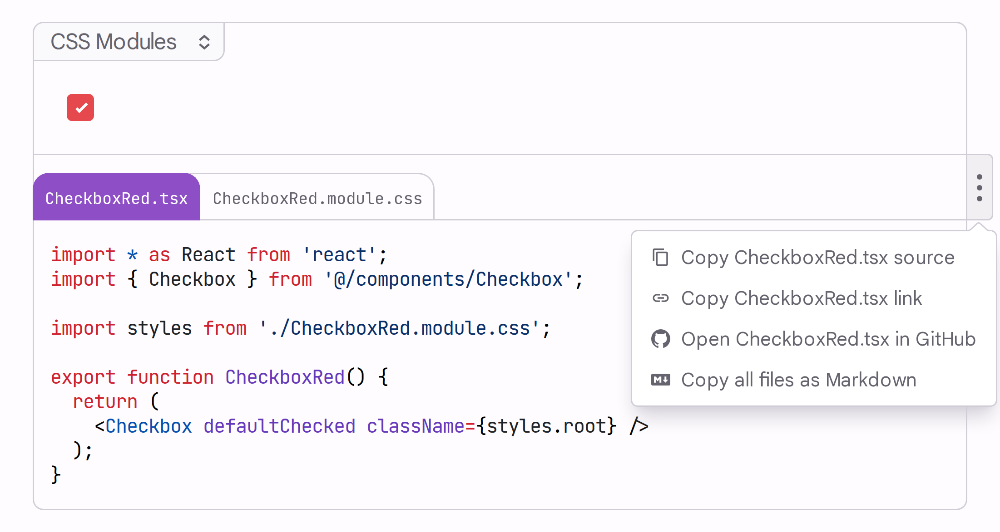

# Components

[//]: # 'This section is autogenerated, but the following list order, title, and [Tag]s can be modified, but nothing within the parentheses.'

<PagesIndex>

- Code Highlighter - ([Outline](#code-highlighter), [Contents](./code-highlighter/page.mdx))
- Code Provider - ([Outline](#code-provider), [Contents](./code-provider/page.mdx))
- Code Controller Context - ([Outline](#code-controller-context), [Contents](./code-controller-context/page.mdx))
- Code Externals Context - ([Outline](#code-externals-context), [Contents](./code-externals-context/page.mdx))
- Coordinated Lazy [New] - ([Outline](#coordinated-lazy), [Contents](./coordinated-lazy/page.mdx))
- Chunk Provider [New] - ([Outline](#chunk-provider), [Contents](./chunk-provider/page.mdx))

[//]: # 'This section is autogenerated, DO NOT EDIT AFTER THIS LINE, run: pnpm docs:validate docs-infra/components'

## Code Highlighter

The `CodeHighlighter` component provides a powerful and flexible way to display interactive code examples with syntax highlighting, multiple variants, and live previews.
It supports both static code blocks and interactive demos with component previews.

Outline

- Sections:
  - Features
  - Basic Usage
  - Demo Factory Pattern
    - Factory Structure
    - Demo File Structure
    - Webpack Loader Integration
  - Advanced Features
    - Client-Side Rendering
    - Controlled Code Scenarios
  - Authoring Recommendations
    - Component Name
    - Demo Titles
    - Descriptions
    - Link to Demo
    - Separators
  - Benchmarking
  - Build-Time vs Server Rendering vs Client Rendering
    - Build-Time (Recommended)
    - Server Rendering
    - Client Rendering
  - Best Practices
  - Troubleshooting
    - Common Issues
  - Shape
    - CodeHighlighter
    - CodeHighlighter Types
- Exports:
  - CodeHighlighter
    - Props: Content, ContentLoading, children, code, collapseToEmpty, components, contentProps, controlled, defaultVariant, deferParsing, editActivation, enhanceAfter, fallbackCollapsed, fallbackUsesAllVariants, fallbackUsesExtraFiles, fileName, forceClient, globalsCode, highlightAfter, initialExpanded, initialVariant, language, loadCodeMeta, loadSource, loadVariantMeta, name, precompute, slug, sourceEnhancers, sourceParser, sourceTransformers, url, urlPrefix, variant, variantType, variants
  - LoadCodeMeta
    - Parameters: url
  - LoadSource
    - Parameters: url
  - LoadVariantMeta
    - Parameters: variantName, url
  - mergeComments
    - Parameters: input, mine
  - ParseSource
    - Parameters: source, fileName, language
  - SourceEnhancer
    - Parameters: root, comments, fileName
  - TransformSource
    - Parameters: source, fileName, comments
  - useCodeFallback
    - Parameters: props
- Types: UseCodeFallbackResult

[Read more](./code-highlighter/page.mdx)

## Code Provider

The `CodeProvider` component provides client-side functions for fetching source code and highlighting it. It's designed for cases where you need to render code blocks or demos based on client-side state or dynamic content loading. It also provides heavy processing functions that are moved from individual components to the context for better performance and code splitting.

Outline

- Sections:
  - Features
  - When to Use CodeProvider
  - Basic Usage
  - Advanced Features
    - Recursive variant: walking imports on demand
    - Choosing between the two approaches
  - Integration with CodeHighlighter
  - Custom Loading Functions
  - Types
  - Worker-Backed Live Highlighting
    - Lifecycle
    - Cancellation
    - Wiring
  - Per-language grammar loading
    - Preloading grammars at the provider level
  - Best Practices
  - Comparison with Other Components
  - Bundle weight: `CodeProvider` vs `CodeProviderLazy`
    - Deduping across a page
  - Troubleshooting
    - Common Issues
- Exports:
  - CodeProvider
    - Props: children, loadCodeMeta, loadSource, loadVariantMeta, sourceEnhancers
  - CodeProviderLazy
    - Props: children, loadCodeMeta, loadSource, loadVariantMeta, preloadGrammars, sourceEnhancers

[Read more](./code-provider/page.mdx)

## Code Controller Context

The `CodeControllerContext` provides a React context for managing controlled code state in interactive code editing and demo scenarios. It enables real-time code editing with syntax highlighting and live component previews.

Outline

- Sections:
  - Features
  - Examples
  - Basic Usage
    - Pattern 1: Code Editor
    - Pattern 2: Live Demo Controller
  - Working with useCode Hook
  - Working with useDemo Hook
  - Data Flow
  - Integration with createDemo
  - Client Dependencies for Live Demos
    - Using createDemoClient
    - Creating a Custom createDemoClient
    - Integration with createLiveDemo
  - Editable Code Focus Trap
    - Why It Exists
    - Interaction Model
    - Styling Hooks
  - Benchmarking
  - Best Practices
  - Types
  - Requirements
  - Related Components
  - Purpose
- Exports:
  - useControlledCode
- Types: CodeControllerContext, Selection

[Read more](./code-controller-context/page.mdx)

## Code Externals Context

The `CodeExternalsContext` is a simple React context that provides access to external dependencies (modules and components) for demo components. It's primarily used internally by demo client providers created with [`abstractCreateDemoClient`](../../factories/abstract-create-demo-client/page.mdx) to make precomputed externals available to child components.

Outline

- Sections:
  - Features
  - Usage
    - Basic Hook Usage
    - Integration with Demo Clients
  - Implementation Details
    - Context Structure
  - Common Patterns
    - Safe External Access
    - Integration with Live Code Execution
    - Conditional Rendering with Externals
    - Debug Available Externals
  - Types
  - When to Use
  - When Not to Use
  - Integration with Build System
  - Related
- Exports:
  - useCodeExternals
- Types: CodeExternalsContext

[Read more](./code-externals-context/page.mdx)

## Coordinated Lazy

`CoordinatedLazy` shows a loading placeholder until its content is ready, then swaps to the content — coordinated with every other block on the page so they settle as a single update instead of a staggered cascade. `createCoordinatedLazy` builds a **self-loading** component on top of it (a demo, a chart, a code frame): one deferred piece that loads its own data and swaps itself in. To stream a _list_ of these in on the client, use [`useStream`](../../hooks/use-stream/page.mdx); to inject build-time data, use [`abstractCreateStream`](../../factories/abstract-create-stream/page.mdx). It is the base of the [Coordinated Streaming](../../patterns/coordinated-streaming/page.mdx) pattern.

Outline

- Sections:
  - What it does
  - Basic Usage
  - createCoordinatedLazy
    - The data `source` (discriminated)
  - useChunk
  - Passing data from the fallback to the content
  - Speculative preload
  - Server rendering
  - LazyContent
  - Advanced: building a custom swap
  - Reference
    - CoordinatedLazy
    - useCoordinatedFallback
    - useCoordinatedContent
    - useCoordinatedSwap
  - Related
- Exports:
  - ChunkServerLoader
    - Parameters: (config, initial, props)
  - CoordinatedLazy
    - Props: awaitContent, content, data, defer, fallback, gate, holdGate, preload, ready, requireHoist, skipFallback
  - createCoordinatedLazy
    - Parameters: config
  - IsInitial
    - Parameters: preloaded
  - IsLoaded
    - Parameters: preloaded
  - LazyComponentImport
  - LazyContent
    - Props: content, fallback, gate, props
  - LazyContentServer
    - Parameters: \_\_0
  - resolveChunkRender
    - Parameters: inputs
  - useChunk
    - Parameters: config, props
  - useCoordinatedContent
  - useCoordinatedFallback
    - Parameters: hoistData
  - useCoordinatedGate
  - useCoordinatedSwap
    - Parameters: options
- Types: ChunkComponentProps, ChunkContentProps, ChunkLoadingProps, ChunkRenderDecision, ChunkRenderInputs, ChunkRenderMode, ChunkSwapConfig, CoordinatedContentContext, CoordinatedContentContextValue, CoordinatedFallbackContext, CoordinatedFallbackContextValue, CoordinatedGateContext, CoordinatedLazyProps, CreateChunkConfig, LazyContentProps, StreamSource, StreamUrlsResult, UseChunkResult, UseCoordinatedFallbackResult, UseCoordinatedSwapOptions, UseCoordinatedSwapResult

[Read more](./coordinated-lazy/page.mdx)

## Chunk Provider

Layout-level providers for the [Coordinated Lazy](../../components/coordinated-lazy/page.mdx) system: a `ChunkProvider` that supplies a lazily-imported client source, and a `PreloadProvider` that dedups speculative imports across instances. Both follow the [Props Context Layering](../../patterns/props-context-layering/page.mdx) pattern — like [`CodeProvider`](../../components/code-provider/page.mdx) does for the code highlighter.

Outline

- Sections:
  - ChunkProvider
  - PreloadProvider & usePreload
  - Additional types
  - Related
- Exports:
  - ChunkProvider
    - Props: children, source
  - PreloadFn
    - Parameters: key, factory
  - PreloadProvider
    - Props: children
  - useChunkContext
  - usePreload
- Types: ChunkContext, ChunkContextValue, ChunkProviderProps, PreloadContext

[Read more](./chunk-provider/page.mdx)

[//]: # 'The above section is autogenerated, but the remainder of the file can be modified.'

</PagesIndex>

export const metadata =
  /** @type {import('@mui/internal-docs-infra/createSitemap/types').NextMetadata} */ ({
    robots: {
      index: true,
    },
  });
