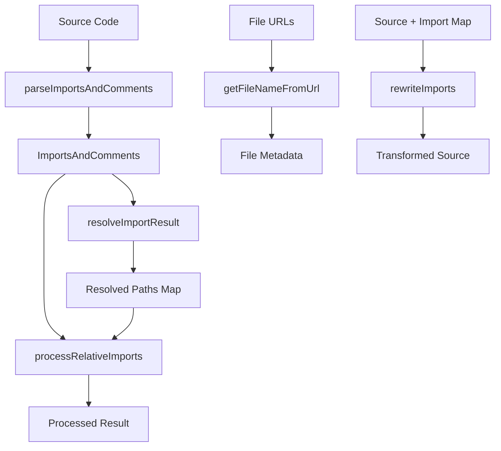

# Loader Utilities

The loader utilities provide a comprehensive set of functions for resolving, parsing, and processing import statements in JavaScript/TypeScript code. These utilities are essential for building systems that need to analyze and transform code imports, such as code highlighters, bundlers, and documentation generators.

## Overview

The loader utilities consist of several interconnected modules:

- **`parseImportsAndComments`** - Parses import statements and optionally processes comments
- **`resolveModulePath`** - Resolves module paths to actual file paths
- **`resolveImportResult`** - Resolves all imports from a parsed result
- **`processRelativeImports`** - Transforms and processes resolved imports
- **`getFileNameFromUrl`** - Extracts file names and extensions from URLs/paths
- **`extractNameAndSlugFromUrl`** - Extracts human-readable names and slugs from URLs
- **`rewriteImports`** - Rewrites import statements in source code
- **`fileUrlToPortablePath`** / **`portablePathToFileUrl`** - Path conversion utilities
- **`getLanguageFromExtension`** / **`normalizeLanguage`** - Language detection utilities
- **`externalsToPackages`** - Converts external imports to package names

## Architecture



## Core Functions

### parseImportsAndComments

Parses import statements from JavaScript/TypeScript/CSS source code and extracts import information. Optionally processes and removes comments.

```typescript
import { parseImportsAndComments } from '@mui/internal-docs-infra/pipeline/loaderUtils';

const source = `
import React from 'react';
import { Component } from '../components/Component';
import type { Props } from '../types';
import '../styles.css';
`;

const result = await parseImportsAndComments(source, 'file:///src/current/file.tsx');
console.log(result);
// {
//   relative: {
//     '../components/Component': {
//       url: 'file:///src/components/Component',
//       names: [{ name: 'Component', type: 'named' }],
//       positions: [{ start: 45, end: 72 }]
//     },
//     '../types': {
//       url: 'file:///src/types',
//       names: [{ name: 'Props', type: 'named', isType: true }],
//       includeTypeDefs: true,
//       positions: [{ start: 100, end: 112 }]
//     },
//     '../styles.css': {
//       url: 'file:///src/styles.css',
//       names: [],
//       positions: [{ start: 130, end: 145 }]
//     }
//   },
//   externals: {
//     'react': {
//       names: [{ name: 'React', type: 'default' }],
//       positions: [{ start: 15, end: 22 }]
//     }
//   }
// }
```

**With comment processing:**

```typescript
const result = await parseImportsAndComments(source, fileUrl, {
  removeCommentsWithPrefix: ['@internal'],
  notableCommentsPrefix: ['TODO'],
});
// Returns: { relative, externals, code, comments }
// - code: source with matching comments removed
// - comments: Record<lineNumber, commentContent[]>
```

**Features:**

- ✓ **Type-aware parsing** - Detects `import type` statements and marks them with `includeTypeDefs: true`
- ✓ **All import patterns** - Named imports, default imports, namespace imports, side-effect imports
- ✓ **Relative path resolution** - Converts relative imports to absolute `file://` URLs
- ✓ **Mixed import handling** - Handles both type and value imports from the same module
- ✓ **Non-JS asset support** - Handles CSS `@import` statements
- ✓ **Position tracking** - Records start/end positions of import paths for rewriting
- ✓ **Comment processing** - Optionally removes comments and collects notable ones
- ✓ **MDX support** - Correctly handles code blocks in MDX files

### resolveModulePath

Resolves module paths to actual file paths using filesystem directory reading.

```typescript
import { resolveModulePath } from '@mui/internal-docs-infra/pipeline/loaderUtils';
import type { DirectoryReader } from '@mui/internal-docs-infra/pipeline/loaderUtils';

// directoryReader returns directory entries for a given file:// URL
const directoryReader: DirectoryReader = async (path) => {
  // Implementation that returns DirectoryEntry[]
};

// Basic resolution - returns file:// URL
const resolved = await resolveModulePath('file:///src/components/Button', directoryReader);
console.log(resolved); // 'file:///src/components/Button.tsx'

// Type-aware resolution - returns object with both paths
const typeAware = await resolveModulePath(
  'file:///src/components/Button',
  directoryReader,
  {},
  true, // includeTypeDefs
);
console.log(typeAware);
// {
//   import: 'file:///src/components/Button.tsx',
//   typeImport: 'file:///src/components/Button.d.ts'
// }
```

**Features:**

- ✓ **Type-aware resolution** - Different extension priorities for type vs value imports
- ✓ **Index file support** - Resolves `Button` to `Button/index.tsx`
- ✓ **Extension priority** - Follows TypeScript resolution rules
- ✓ **Optimized filesystem access** - Single directory read when possible
- ✓ **File URL handling** - Works with `file://` URLs and portable paths

**Extension Priorities:**

- **Value imports**: `.ts`, `.tsx`, `.js`, `.jsx`, `.mdx`, `.d.ts`
- **Type imports**: `.d.ts`, `.ts`, `.tsx`, `.js`, `.jsx`, `.mdx`

### resolveModulePaths

Resolves multiple module paths efficiently by grouping them by directory.

```typescript
import { resolveModulePaths } from '@mui/internal-docs-infra/pipeline/loaderUtils';

const paths = ['/src/components/Button', '/src/components/Input', '/src/utils/helpers'];

const resolved = await resolveModulePaths(paths, directoryReader);
// Map {
//   '/src/components/Button' => 'file:///src/components/Button.tsx',
//   '/src/components/Input' => 'file:///src/components/Input.tsx',
//   '/src/utils/helpers' => 'file:///src/utils/helpers/index.ts'
// }
```

### resolveImportResult

Resolves all imports from a `parseImportsAndComments` result, handling JavaScript modules and static assets differently.

```typescript
import {
  parseImportsAndComments,
  resolveImportResult,
} from '@mui/internal-docs-infra/pipeline/loaderUtils';

const { relative } = await parseImportsAndComments(source, fileUrl);
const resolved = await resolveImportResult(relative, directoryReader);
// Map from import URL to resolved file:// URL
```

### resolveVariantPaths

Resolves variant paths from a variants object (useful for demo systems).

```typescript
import { resolveVariantPaths } from '@mui/internal-docs-infra/pipeline/loaderUtils';

const variants = {
  TypeScript: '/src/demos/Button',
  JavaScript: '/src/demos/Button.js',
};

const resolved = await resolveVariantPaths(variants, directoryReader);
// Map {
//   'TypeScript' => 'file:///src/demos/Button.tsx',
//   'JavaScript' => 'file:///src/demos/Button.js'
// }
```

### processRelativeImports

Transforms resolved imports based on different storage strategies.

```typescript
import { processRelativeImports } from '@mui/internal-docs-infra/pipeline/loaderUtils';

const result = processRelativeImports(
  source,
  importResult.relative, // from parseImportsAndComments
  'flat', // storeAt mode: 'flat' | 'canonical' | 'import'
  true, // isJsFile: true for JS/TS, false for CSS/JSON
  resolvedPathsMap, // from resolveImportResult (required for JS files)
);

console.log(result);
// {
//   processedSource: "import Component from './Component';",
//   extraFiles: {
//     './Component.tsx': 'file:///src/components/Component.tsx'
//   }
// }
```

**Storage Strategies:**

1. **`flat`** - Flattens all imports to current directory level

   ```typescript
   // import Component from '../components/Component';
   // File stored at: ../components/Component/index.tsx
   // File Displayed As:  Component.tsx
   ```

2. **`import`** - Preserves original import path without rewriting

   ```typescript
   // import Component from '../components/Component';
   // File Stored at: ../components/Component/index.tsx
   // File Displayed As:  ../components/Component.tsx
   ```

3. **`canonical`** - Preserves the original file structure
   ```typescript
   // import Component from '../components/Component';
   // File Stored at: ../components/Component/index.tsx
   // File Displayed As:  ../components/Component/index.tsx
   ```

### getFileNameFromUrl

Extracts file names and extensions from URLs and file paths.

```typescript
import { getFileNameFromUrl } from '@mui/internal-docs-infra/pipeline/loaderUtils';

const meta = getFileNameFromUrl('file:///src/components/Button.tsx');
console.log(meta); // { fileName: 'Button.tsx', extension: '.tsx' }

// Handles compound extensions
const types = getFileNameFromUrl('file:///src/types.d.ts');
console.log(types); // { fileName: 'types.d.ts', extension: '.d.ts' }

// Handles CSS modules
const cssModule = getFileNameFromUrl('file:///src/styles.module.css');
console.log(cssModule); // { fileName: 'styles.module.css', extension: '.module.css' }

// Works with URLs
const url = getFileNameFromUrl('https://example.com/file.js');
console.log(url); // { fileName: 'file.js', extension: '.js' }
```

**Supported Compound Extensions:**

`.module.css`, `.module.scss`, `.d.ts`, `.test.ts`, `.test.tsx`, `.spec.ts`, `.config.ts`, `.stories.tsx`, and more.

### extractNameAndSlugFromUrl

Extracts and formats human-readable names and URL-friendly slugs from file paths.

```typescript
import { extractNameAndSlugFromUrl } from '@mui/internal-docs-infra/pipeline/loaderUtils';

// Handles index files (uses parent directory name)
const demo = extractNameAndSlugFromUrl('file:///app/components/demos/advanced-keyboard/index.ts');
console.log(demo); // { name: 'Advanced Keyboard', slug: 'advanced-keyboard' }

// Handles camelCase filenames
const camel = extractNameAndSlugFromUrl('/src/components/customButton.tsx');
console.log(camel); // { name: 'Custom Button', slug: 'custom-button' }

// Handles kebab-case filenames
const kebab = extractNameAndSlugFromUrl('/src/components/button-group.tsx');
console.log(kebab); // { name: 'Button Group', slug: 'button-group' }
```

**Features:**

- ✓ **Index file handling** - Uses parent directory name for `index.*` files
- ✓ **Extension stripping** - Removes all file extensions (`.js`, `.d.ts`, `.module.css`, etc.)
- ✓ **camelCase conversion** - Converts `customButton` to `Custom Button` / `custom-button`
- ✓ **kebab-case conversion** - Converts `button-group` to `Button Group` / `button-group`
- ✓ **URL protocol support** - Handles `file://` URLs and regular paths

### externalsToPackages

Converts an array of external import paths to a packages object for dependency tracking.

```typescript
import { externalsToPackages } from '@mui/internal-docs-infra/pipeline/loaderUtils';

const externals = [
  'react',
  'react-dom',
  '@mui/internal-docs-infra/CodeHighlighter',
  '@mui/internal-docs-infra/pipeline/parseSource',
  'lodash/get',
  'some-package/submodule/deep',
  '@/components/Button', // path alias - filtered out
];

const packages = externalsToPackages(externals);
console.log(packages);
// {
//   'react': true,
//   'react-dom': true,
//   '@mui/internal-docs-infra': true,
//   'lodash': true,
//   'some-package': true
// }
```

**Features:**

- ✓ **Scoped package handling** - Extracts `@scope/package` from longer paths
- ✓ **Submodule extraction** - Converts `lodash/get` to `lodash`
- ✓ **Path alias filtering** - Ignores imports starting with `@/`
- ✓ **Deduplication** - Returns unique packages as object keys

### rewriteImports

Rewrites import statements in source code based on a mapping, using precise position data.

```typescript
import { rewriteImports } from '@mui/internal-docs-infra/pipeline/loaderUtils';

const source = `
import Component from '../components/Component';
import { helper } from '../utils/helper';
`;

const importPathMapping = new Map([
  ['../components/Component', './Component'],
  ['../utils/helper', './helper'],
]);

// importResult contains position data from parseImportsAndComments
const rewritten = rewriteImports(source, importPathMapping, importResult.relative);
console.log(rewritten);
// import Component from './Component';
// import { helper } from './helper';
```

### rewriteImportsToNull

Converts import statements to const declarations set to null. Useful when precomputing data that makes imports unnecessary.

```typescript
import { rewriteImportsToNull } from '@mui/internal-docs-infra/pipeline/loaderUtils';

const source = `import { Component } from './Component';`;

const importPathsToRewrite = new Set(['./Component']);
const rewritten = rewriteImportsToNull(source, importPathsToRewrite, importResult.relative);
console.log(rewritten);
// const Component = null;
```

### removeImports

Removes entire import statements for specified import paths.

```typescript
import { removeImports } from '@mui/internal-docs-infra/pipeline/loaderUtils';

const source = `
import React from 'react';
import { helper } from './helper';
`;

const importPathsToRemove = new Set(['./helper']);
const result = removeImports(source, importPathsToRemove, importResult.relative);
console.log(result);
// import React from 'react';
```

## Path Conversion Utilities

### fileUrlToPortablePath

Converts a `file://` URL to a portable POSIX-style path for cross-platform path manipulation.

```typescript
import { fileUrlToPortablePath } from '@mui/internal-docs-infra/pipeline/loaderUtils';

// Unix
fileUrlToPortablePath('file:///home/user/file.ts');
// => '/home/user/file.ts'

// Windows
fileUrlToPortablePath('file:///C:/Users/file.ts');
// => '/C:/Users/file.ts'

// Already a portable path (passthrough)
fileUrlToPortablePath('/home/user/file.ts');
// => '/home/user/file.ts'
```

### portablePathToFileUrl

Converts a portable path back to a `file://` URL.

```typescript
import { portablePathToFileUrl } from '@mui/internal-docs-infra/pipeline/loaderUtils';

portablePathToFileUrl('/home/user/file.ts');
// => 'file:///home/user/file.ts'

portablePathToFileUrl('/C:/Users/file.ts');
// => 'file:///C:/Users/file.ts'

// Already a URL (passthrough)
portablePathToFileUrl('file:///home/user/file.ts');
// => 'file:///home/user/file.ts'
```

## Language Detection Utilities

### getLanguageFromExtension

Gets the language name from a file extension.

```typescript
import { getLanguageFromExtension } from '@mui/internal-docs-infra/pipeline/loaderUtils';

getLanguageFromExtension('.tsx'); // => 'tsx'
getLanguageFromExtension('.ts'); // => 'typescript'
getLanguageFromExtension('.css'); // => 'css'
getLanguageFromExtension('.mdx'); // => 'mdx'
```

### normalizeLanguage

Normalizes language aliases to canonical names.

```typescript
import { normalizeLanguage } from '@mui/internal-docs-infra/pipeline/loaderUtils';

normalizeLanguage('js'); // => 'javascript'
normalizeLanguage('ts'); // => 'typescript'
normalizeLanguage('bash'); // => 'shell'
normalizeLanguage('yml'); // => 'yaml'
```

### languageMap / languageAliasMap

Constants for extension-to-language and alias-to-language mappings.

```typescript
import { languageMap, languageAliasMap } from '@mui/internal-docs-infra/pipeline/loaderUtils';

// languageMap: { '.js': 'javascript', '.ts': 'typescript', ... }
// languageAliasMap: { 'js': 'javascript', 'bash': 'shell', ... }
```

## Module Detection

### isJavaScriptModule

Checks if a path represents a JavaScript/TypeScript module.

```typescript
import { isJavaScriptModule } from '@mui/internal-docs-infra/pipeline/loaderUtils';

isJavaScriptModule('./component.tsx'); // => true
isJavaScriptModule('./styles.css'); // => false
isJavaScriptModule('./data.json'); // => false
isJavaScriptModule('./module'); // => true (no extension = assumed JS module)
```

## Complete Pipeline Example

Here's how to use all the utilities together for a complete import processing pipeline:

```typescript
import {
  parseImportsAndComments,
  resolveImportResult,
  processRelativeImports,
} from '@mui/internal-docs-infra/pipeline/loaderUtils';
import type { DirectoryReader } from '@mui/internal-docs-infra/pipeline/loaderUtils';

// Create a directory reader (implementation depends on your environment)
const directoryReader: DirectoryReader = async (dirUrl) => {
  // Return DirectoryEntry[] for the given file:// URL
};

async function processCodeImports(source: string, fileUrl: string) {
  // 1. Parse imports from source
  const { relative, externals } = await parseImportsAndComments(source, fileUrl);

  // 2. Resolve import paths to actual files
  const resolvedPathsMap = await resolveImportResult(relative, directoryReader);

  // 3. Process and transform the imports
  const result = processRelativeImports(
    source,
    relative,
    'flat',
    true, // isJsFile
    resolvedPathsMap,
  );

  return { result, externals };
}

// Usage
const source = `
import React from 'react';
import { Button } from '../components/Button';
import type { Props } from '../types';
import '../styles.css';
`;

const { result, externals } = await processCodeImports(source, 'file:///src/demo/example.tsx');

console.log(result.processedSource);
// import React from 'react';
// import { Button } from './Button';
// import type { Props } from './types';
// import './styles.css';

console.log(result.extraFiles);
// {
//   './Button.tsx': 'file:///src/components/Button.tsx',
//   './types.d.ts': 'file:///src/types.d.ts',
//   './styles.css': 'file:///src/styles.css'
// }

console.log(externals);
// {
//   'react': {
//     names: [{ name: 'React', type: 'default' }],
//     positions: [...]
//   }
// }
```

## Type Definitions

### Import Types

```typescript
/** Represents a single import name with its properties */
interface ImportName {
  /** The imported name or identifier */
  name: string;
  /** The alias used when importing (e.g., 'as newName') */
  alias?: string;
  /** The type of import: default, named, or namespace (*) */
  type: 'default' | 'named' | 'namespace';
  /** Whether this is a TypeScript type-only import */
  isType?: boolean;
}

/** Represents the position of an import path in the source code */
interface ImportPathPosition {
  /** The start index of the import path (including quotes) */
  start: number;
  /** The end index of the import path (including quotes) */
  end: number;
}

/** Represents an import from a relative path */
interface RelativeImport {
  /** The resolved absolute URL to the imported file (file:// URL) */
  url: string;
  /** Array of imported names from this module */
  names: ImportName[];
  /** Whether TypeScript type definitions should be included */
  includeTypeDefs?: true;
  /** Array of positions where this import path appears */
  positions: ImportPathPosition[];
}

/** Represents an import from an external package */
interface ExternalImport {
  /** Array of imported names from this external package */
  names: ImportName[];
  /** Array of positions where this import path appears */
  positions: ImportPathPosition[];
}

/** The result of parsing import statements */
interface ImportsAndComments {
  /** Map of relative import paths to their import details */
  relative: Record<string, RelativeImport>;
  /** Map of external package names to their import details */
  externals: Record<string, ExternalImport>;
  /** The processed code with comments removed (if comment processing was requested) */
  code?: string;
  /** Map of line numbers to arrays of comment content */
  comments?: Record<number, string[]>;
}
```

### Resolution Types

```typescript
interface DirectoryEntry {
  name: string;
  isFile: boolean;
  isDirectory: boolean;
}

type DirectoryReader = (path: string) => Promise<DirectoryEntry[]>;

interface ResolveModulePathOptions {
  /** Array of file extensions to try when resolving modules */
  extensions?: string[];
}

interface TypeAwareResolveResult {
  import: string;
  typeImport?: string;
}
```

### Processing Types

```typescript
type StoreAtMode = 'canonical' | 'import' | 'flat';

interface ProcessImportsResult {
  processedSource: string;
  extraFiles: Record<string, string>;
}
```

### Extension Constants

```typescript
// Default extensions for JavaScript/TypeScript modules
const JAVASCRIPT_MODULE_EXTENSIONS = ['.ts', '.tsx', '.js', '.jsx', '.mdx', '.d.ts'];

// Type import extensions (prioritize .d.ts first)
const TYPE_IMPORT_EXTENSIONS = ['.d.ts', '.ts', '.tsx', '.js', '.jsx', '.mdx'];

// Value import extensions (standard priority)
const VALUE_IMPORT_EXTENSIONS = ['.ts', '.tsx', '.js', '.jsx', '.mdx', '.d.ts'];
```

## Performance Optimizations

### Filesystem Access Optimization

The utilities are optimized to minimize filesystem calls:

- **Single directory read** when `includeTypeDefs` is enabled
- **Batch resolution** for multiple imports in the same directory
- **Efficient file mapping** using basename lookups
- **Index file caching** for directory-based imports

## Error Handling

All functions include comprehensive error handling:

```typescript
try {
  const result = await resolveModulePath('/nonexistent/path', directoryReader);
} catch (error) {
  console.error(`Module resolution failed: ${error.message}`);
  // Error: Could not resolve module at path "/nonexistent/path".
  // Tried extensions: .ts, .tsx, .js, .jsx, .d.ts
}
```

## Testing

The utilities include comprehensive test coverage:

- **102 total tests** across 7 test files
- **Integration tests** for full pipeline scenarios
- **Unit tests** for individual functions
- **Edge case coverage** for error conditions
- **Performance benchmarks** for optimization verification
