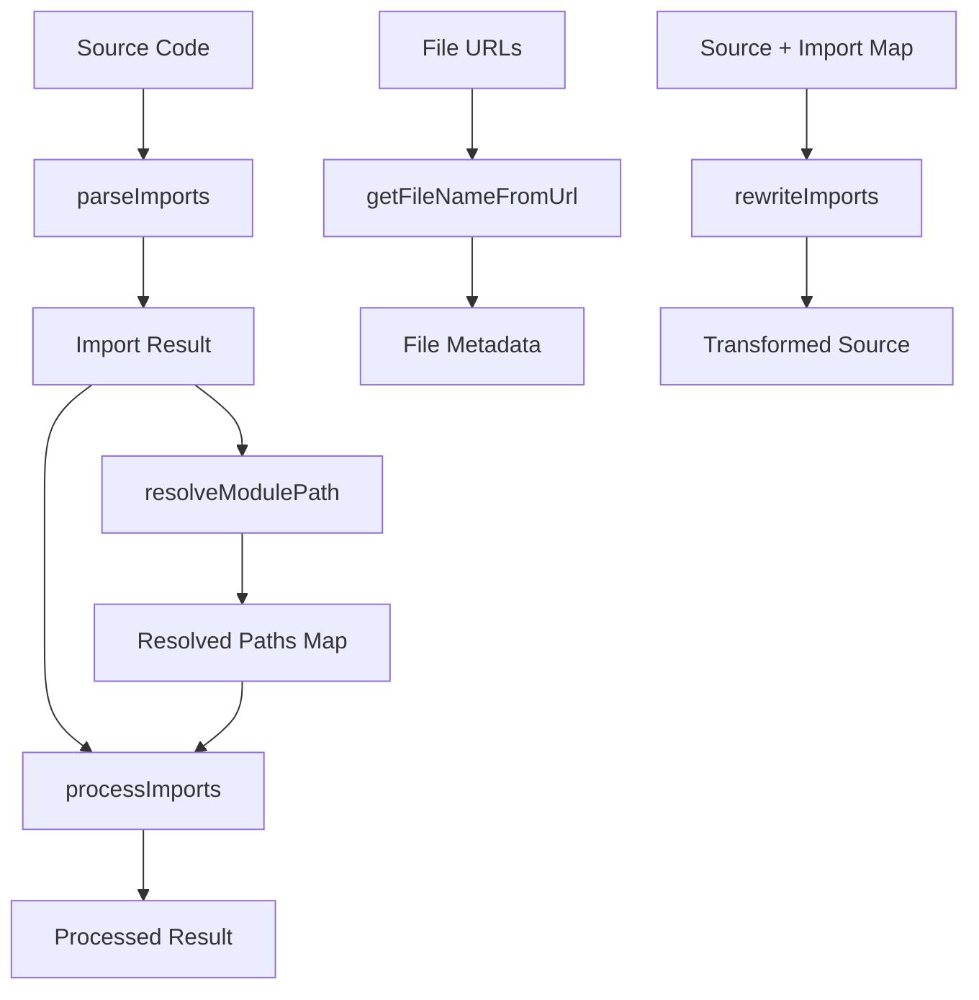

# Loader Utilities

The loader utilities provide a comprehensive set of functions for resolving, parsing, and processing import statements in JavaScript/TypeScript code. These utilities are essential for building systems that need to analyze and transform code imports, such as code highlighters, bundlers, and documentation generators.

## Overview

The loader utilities consist of several interconnected modules:

- **`parseImports`** - Parses import statements from source code
- **`resolveModulePath`** - Resolves module paths to actual file paths
- **`processImports`** - Transforms and processes resolved imports
- **`getFileNameFromUrl`** - Extracts file names and extensions from URLs/paths
- **`rewriteImports`** - Rewrites import statements in source code

## Architecture



## Core Functions

### parseImports

Parses import statements from JavaScript/TypeScript source code and extracts import information.

```typescript
import { parseImports } from '@mui/internal-docs-infra/loaderUtils';

const source = `
import React from 'react';
import { Component } from '../components/Component';
import type { Props } from '../types';
import '../styles.css';
`;

const result = await parseImports(source, '/src/current/file.tsx');
console.log(result);
// {
//   '../components/Component': {
//     path: '/src/components/Component',
//     names: ['Component']
//   },
//   '../types': {
//     path: '/src/types',
//     names: ['Props'],
//     includeTypeDefs: true
//   },
//   '../styles.css': {
//     path: '/src/styles.css',
//     names: []
//   }
// }
```

**Features:**
- ✅ **Type-aware parsing** - Detects `import type` statements and marks them with `includeTypeDefs: true`
- ✅ **All import patterns** - Named imports, default imports, namespace imports, side-effect imports
- ✅ **Relative path resolution** - Converts relative imports to absolute paths
- ✅ **Mixed import handling** - Handles both type and value imports from the same module
- ✅ **Non-JS asset support** - Handles CSS, images, and other static assets

### resolveModulePath

Resolves module paths to actual file paths using filesystem directory reading.

```typescript
import { resolveModulePath } from '@mui/internal-docs-infra/loaderUtils';

// Basic resolution
const resolved = await resolveModulePath(
  '/src/components/Button',
  directoryReader
);
console.log(resolved); // '/src/components/Button.jsx'

// Type-aware resolution
const typeAware = await resolveModulePath(
  '/src/components/Button',
  directoryReader,
  {},
  true // includeTypeDefs
);
console.log(typeAware); 
// { 
//   import: '/src/components/Button.jsx',
//   typeImport: '/src/components/Button.d.ts' 
// }
```

**Features:**
- ✅ **Type-aware resolution** - Different extension priorities for type vs value imports
- ✅ **Index file support** - Resolves `Button` to `Button/index.tsx`
- ✅ **Extension priority** - Follows TypeScript resolution rules
- ✅ **Optimized filesystem access** - Single directory read when possible
- ✅ **Batch resolution** - Efficient resolution of multiple paths

**Extension Priorities:**
- **Value imports**: `.ts`, `.tsx`, `.js`, `.jsx`, `.d.ts`
- **Type imports**: `.d.ts`, `.ts`, `.tsx`, `.js`, `.jsx`

### processImports

Transforms resolved imports based on different storage strategies.

```typescript
import { processImports } from '@mui/internal-docs-infra/loaderUtils';

const result = processImports(
  source,
  importResult,
  resolvedPathsMap,
  'flat' // or 'canonical' | 'import'
);

console.log(result);
// {
//   processedSource: "import Component from './Component';",
//   extraFiles: {
//     './Component.tsx': 'file:///src/components/Component.tsx'
//   }
// }
```

**Storage Strategies:**

1. **`flat`** - Flattens all imports to current directory level
   ```typescript
   // import Component from '../components/Component';
   // File stored at: ../components/Component/index.tsx
   // File Displayed As:  Component.tsx
   ```

2. **`import`** - Preserves original import path without rewriting
   ```typescript
   // import Component from '../components/Component';
   // File Stored at: ../components/Component/index.tsx
   // File Displayed As:  ../components/Component.tsx
   ```

3. **`canonical`** - Preserves the original file structure
   ```typescript
   // import Component from '../components/Component';
   // File Stored at: ../components/Component/index.tsx
   // File Displayed As:  ../components/Component/index.tsx
   ```

### getFileNameFromUrl

Extracts file names and extensions from URLs and file paths.

```typescript
import { getFileNameFromUrl } from '@mui/internal-docs-infra/loaderUtils';

const meta = getFileNameFromUrl('file:///src/components/Button.tsx');
console.log(meta); // { fileName: 'Button.tsx', extension: '.tsx' }

// Handles compound extensions
const types = getFileNameFromUrl('file:///src/types.d.ts');
console.log(types); // { fileName: 'types.d.ts', extension: '.ts' }

// Works with URLs
const url = getFileNameFromUrl('https://example.com/file.js');
console.log(url); // { fileName: 'file.js', extension: '.js' }
```

### rewriteImports

Rewrites import statements in source code based on a mapping.

```typescript
import { rewriteImports } from '@mui/internal-docs-infra/loaderUtils';

const source = `
import Component from '../components/Component';
import { helper } from '../utils/helper';
`;

const importMap = new Map([
  ['../components/Component', './Component'],
  ['../utils/helper', './helper']
]);

const rewritten = rewriteImports(source, importMap);
console.log(rewritten);
// import Component from './Component';
// import { helper } from './helper';
```

## Filesystem Wrappers

For Node.js environments, filesystem wrapper functions provide convenient access:

```typescript
import { 
  resolveModulePathWithFs,
  resolveImportResultWithFs,
  resolveVariantPathsWithFs 
} from '@mui/internal-docs-infra/loaderUtils';

// Basic resolution with Node.js filesystem
const resolved = await resolveModulePathWithFs('/src/components/Button');

// Type-aware resolution
const typeAware = await resolveModulePathWithFs(
  '/src/components/Button',
  {},
  true // includeTypeDefs
);

// Batch import resolution
const importResult = await parseImports(source, filePath);
const resolvedPaths = await resolveImportResultWithFs(importResult);
```

## Complete Pipeline Example

Here's how to use all the utilities together for a complete import processing pipeline:

```typescript
import { parseImports, resolveImportResultWithFs, processImports } from '@mui/internal-docs-infra/loaderUtils';

async function processCodeImports(source: string, filePath: string) {
  // 1. Parse imports from source
  const importResult = await parseImports(source, filePath);
  
  // 2. Resolve import paths to actual files
  const resolvedPathsMap = await resolveImportResultWithFs(importResult);
  
  // 3. Process and transform the imports
  const result = processImports(
    source,
    importResult,
    resolvedPathsMap,
    'flat'
  );
  
  return result;
}

// Usage
const source = `
import React from 'react';
import { Button } from '../components/Button';
import type { Props } from '../types';
import '../styles.css';
`;

const result = await processCodeImports(source, '/src/demo/example.tsx');

console.log(result.processedSource);
// import React from 'react';
// import { Button } from './Button';
// import type { Props } from './types';
// import './styles.css';

console.log(result.extraFiles);
// {
//   './Button.tsx': 'file:///src/components/Button.tsx',
//   './types.d.ts': 'file:///src/types.d.ts',
//   './styles.css': 'file:///src/styles.css'
// }
```

## Type Definitions

### Core Types

```typescript
interface DirectoryEntry {
  name: string;
  isFile: boolean;
  isDirectory: boolean;
}

type DirectoryReader = (path: string) => Promise<DirectoryEntry[]>;

interface ResolveModulePathOptions {
  extensions?: string[];
}

interface TypeAwareResolveResult {
  import: string;
  typeImport?: string;
}

type ImportResult = Record<string, {
  path: string;
  names: string[];
  includeTypeDefs?: true;
}>;

interface ProcessedImportResult {
  processedSource: string;
  extraFiles: Record<string, string>;
}
```

### Extension Constants

```typescript
// Default extensions for JavaScript/TypeScript modules
const JAVASCRIPT_MODULE_EXTENSIONS = ['.ts', '.tsx', '.js', '.jsx', '.d.ts'];

// Type import extensions (prioritize .d.ts first)
const TYPE_IMPORT_EXTENSIONS = ['.d.ts', '.ts', '.tsx', '.js', '.jsx'];

// Value import extensions (standard priority)
const VALUE_IMPORT_EXTENSIONS = ['.ts', '.tsx', '.js', '.jsx', '.d.ts'];
```

## Performance Optimizations

### Filesystem Access Optimization

The utilities are optimized to minimize filesystem calls:

- **Single directory read** when `includeTypeDefs` is enabled
- **Batch resolution** for multiple imports in the same directory
- **Efficient file mapping** using basename lookups
- **Index file caching** for directory-based imports

## Error Handling

All functions include comprehensive error handling:

```typescript
try {
  const result = await resolveModulePath('/nonexistent/path', directoryReader);
} catch (error) {
  console.error(`Module resolution failed: ${error.message}`);
  // Error: Could not resolve module at path "/nonexistent/path". 
  // Tried extensions: .ts, .tsx, .js, .jsx, .d.ts
}
```

## Testing

The utilities include comprehensive test coverage:

- **102 total tests** across 7 test files
- **Integration tests** for full pipeline scenarios
- **Unit tests** for individual functions
- **Edge case coverage** for error conditions
- **Performance benchmarks** for optimization verification
